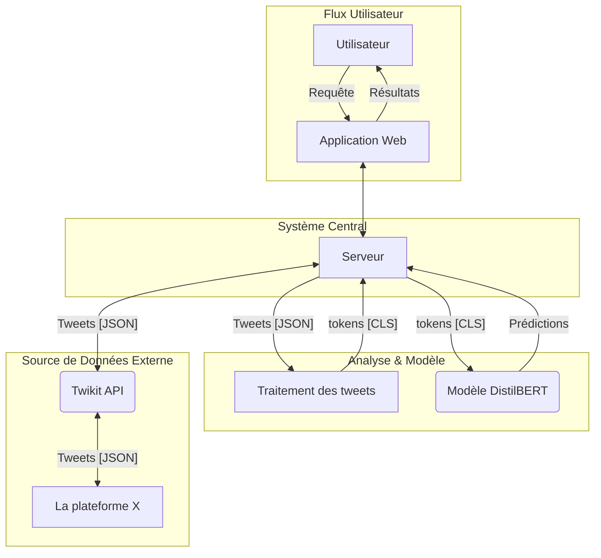

<!--  -->

<h1>TweetSent-APP</h1>

A web application for real-time sentiment analysis of tweets and text using a high-performance DistilBERT model.

TweetSent-APP is an end-to-end solution designed to interpret online conversations. It leverages a fine-tuned an AI model (DistilBERT) to analyze the sentiment of tweets and user-provided text, achieving 98% accuracy.

🚀 Features

Free Text Analysis: Analyze any text pasted into the application to get a detailed sentiment breakdown.

Twitter Hashtag Analysis: Enter a hashtag to pull and analyze recent tweets in real-time.

Detailed Results:

Overall Sentiment: Clear classification (Positive, Negative, Neutral) with a confidence score.

Sentiment Distribution: Visual breakdown of sentiment percentages.

Word Cloud: A dynamic word cloud showing the most frequent terms.

Key Sentiment Drivers: Highlights the specific words that influenced the sentiment score.

Individual Tweet List: See the text and score for each analyzed tweet.

🛠️ Tech Stack

Frontend: HTML5, CSS3, JavaScript, JQuery, AJAX

Backend: Python (Flask)

Sentiment Analysis Model: Fine-tuned DistilBERT (from Hugging Face Transformers) with 98% accuracy.

Model Training: TensorFlow / Keras

Twitter Data: Twikit (to access Twitter/X data without the official paid API)

Data Visualization: Matplotlib (for word clouds) & Chart.js (or similar, for distribution bars)

⚙️ Installation & Setup

Clone the repository:

git clone [https://github.com/OubellaAbdallah/TweetSent-APP.git](https://github.com/OubellaAbdallah/TweetSent-APP.git)
cd TweetSent-APP

Set up the Backend (Python Environment):

# Create a virtual environment
python -m venv venv
source venv/bin/activate  # On Windows: venv\Scripts\activate

# Install dependencies from your requirements file
pip install -r requirements.txt

(Note: requirements.txt should include tensorflow, transformers, flask, twikit, langdetect, nltk, matplotlib, wordcloud, etc., as per Annexe B).

Environment Setup (Twikit Authentication):
This project uses Twikit which requires an authenticated cookie file to function.

Log in to X (Twitter) in a browser.

Export your browser cookies into a file named cookies.json.

Place the cookies.json file in the root of your backend directory (where the script will load it).

Run the application:

Run the backend Flask server:

flask run
# or
python app.py

Open the index.html (or equivalent) frontend file in your browser, or navigate to the URL provided by Flask (e.g., http://127.0.0.1:5000).

Usage

After starting the application:

For Text Analysis:

Go to the "Text Analysis" tab.

Paste your text into the text area.

Click "Analyze Sentiment".

View the results (overall sentiment, key drivers, distribution).

For Twitter Analysis:

Go to the "Twitter Hashtag Analysis" tab.

Enter a hashtag (e.g., #AI).

Click "Search".

View the aggregated results (word cloud, sentiment counts) and the individual tweet breakdown.

🤝 Contributing

Contributions are welcome! If you'd like to help improve this project, please feel free to fork the repository and submit a pull request.

Fork the Project

Create your Feature Branch (git checkout -b feature/AmazingFeature)

Commit your Changes (git commit -m 'Add some AmazingFeature')

Push to the Branch (git push origin feature/AmazingFeature)

Open a Pull Request

📄 License

This project is licensed under the MIT License. See the LICENSE file for more details.

(Note: If you haven't added a LICENSE file, you should! You can easily add one on GitHub.)
